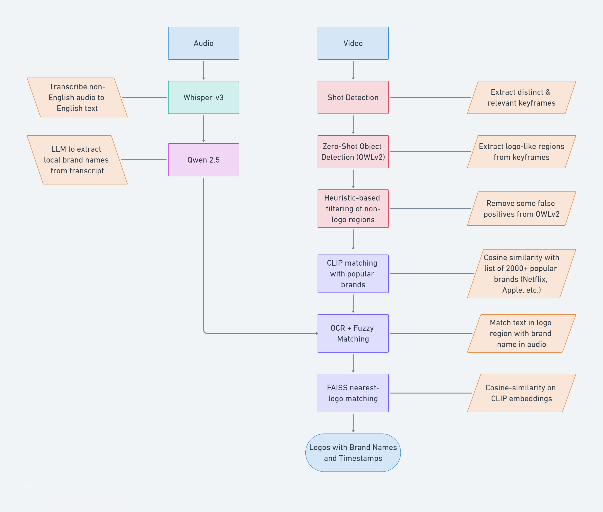

# 🎯 Semi-Automated Logo Detection in Brand Advertisement Videos

An application for semi-automated logo detection in brand advertisement videos using multimodal machine learning.

## Overview

This is an application that allow detection of logos in non-English brand advertisment videos using multimodal ML techniques. The overall pipeline is:
- Run the `Whisper` model on audio of the advertisement to transcribe it from the source language (Italian for e.g.) to English.
- Apply an LLM like `Qwen 2.5` to obtain all brand names mentioned in the audio transcript.
- Run _shot detection_ on the video to obtain the most distinct, relevant keyframes.
- On each keyframe, run a _zero-shot object detection_ model such as `OWLv2` with prompt to extract as many _logo-like_ regions as possible i.e. crops that may contain an actual logo.
- Some of the regions that are not logos i.e. false positives are removed using CLIP-based filtering.
- All of the crops/regions then run through the following brand assignment techniques:
  - Use `CLIP` model to assign each region a brand from a list of top ~2000 brands (Netflix, Apple, etc.) obtained publicly from Kaggle.
  - Use `Optical Character Recognition (OCR)` along with `fuzzy string matching` to assign leftover regions a brand from the brand names extracted from the audio.
  - Use `FAISS` vector store to assign leftover regions a brand from the nearest-matching logo in the vector store. The vector store is pre-populated with the [LogoDet-3K](https://github.com/Wangjing1551/LogoDet-3K-Dataset) dataset for now.
- The `FAISS` vector store enables continual learning of new logos over time via human labelling, logo scraping, etc.
- A `Gradio` application allows the user to upload a video, run the pipeline, and view the matched regions/logos with corresponding brand names and timestamps.

## Advantages
- No need for manual training/fine-tuning of object detection models on custom logos.
- Local, indigenous brands detected using the audio transcript with OCR & fuzzy matching.
- CLIP model works quite well for detecting global, popular brands.
- Vector stores like FAISS enable continual learning and detection of new logos over time.
- Overall pipeline is agnostic to the domain (Ads, sports, etc.) and the source language.

 ## Challenges & Limitations
 - Some false positives obtained from OWLv2 pass unfiltered through the remaining pipeline.
 - If a brand is not popular, not present in the vector store, and is not mentioned in the audio explicitly, it's logos will not be detected.
 - Currently, the pipeline runs slower than would be ideal. We are trying to implement optimizations such as replacing CLIP-based filtering with heuristic-based filtering, replacing EasyOCR with PaddleOCR, and using batched version of RapidFuzz for fuzzy matching.

## Usage
1. Clone the Repository.
2. Set up and activate a python virtual environment (optional).
3. Run `pip install requirements.txt` to install the necessary dependencies.
4. Run `gradio gradio_app.py` to launch the gradio UI.
6. Upload a short brand advertisement video of your choice.
7. Type or copy-paste your `HuggingFace Hub` API key. You can obtain this for free.
8. Click on `Run Pipeline` to run the pipeline.
9. View the logos detected with corresponding brand names and timestamps on the right after pipeline finishes.
